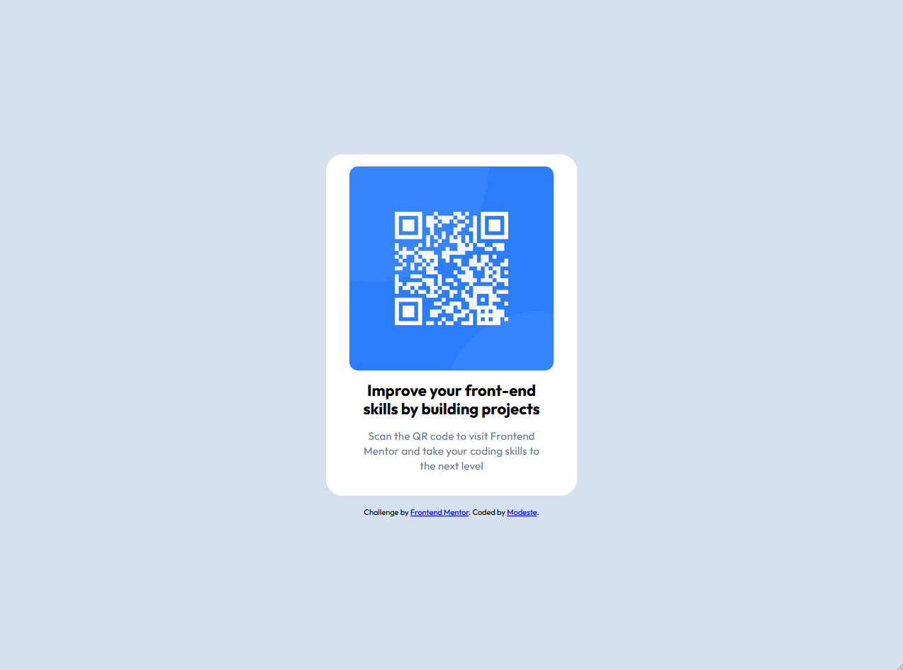

# Frontend Mentor - QR Code Component

Cette solution correspond au challenge [QR Code Component](https://www.frontendmentor.io/challenges/qr-code-component-iux_sIO_H) proposé par **Frontend Mentor**.  
Ce projet m’a permis de pratiquer **HTML et CSS** en recréant un design responsive et fidèle à la maquette.

---

## Aperçu

### Lien vers le site
- [🔗 Voir le projet en ligne](https://zm404notfound.github.io/qr-code-component-main/)

### Capture d’écran

                    (./images/Realisation-Mobile.png)

---

## Ce que j’ai appris
- Comment structurer une carte avec **HTML sémantique** (`<main>`, `<section>`, `<footer>`).
- Utiliser **Flexbox** pour centrer un élément verticalement et horizontalement.
- Gérer les **espacements (margin, padding)** et les **unités relatives (`rem`)**.
- Créer une **version responsive** avec `@media (max-width: 767px)`.
- Comprendre et utiliser un **style guide** (couleurs HEX, typographie, line-height).

---

## Technologies utilisées
- **HTML5**
- **CSS3**
- **Flexbox**
- **Responsive Design**

---

## Ressources utiles
- [MDN - Flexbox](https://developer.mozilla.org/fr/docs/Learn/CSS/CSS_layout/Flexbox)
- [Guide des Media Queries](https://css-tricks.com/css-media-queries/)
- [Frontend Mentor](https://www.frontendmentor.io/)

---

## Auteur
- Frontend Mentor – [@zm404notfound](https://www.frontendmentor.io/profile/zm404notfound)
- GitHub – [zm404notfound](https://github.com/zm404notfound)

---

## Remerciements
Merci à **Frontend Mentor** pour ce challenge qui m'a permis d'améliorer ma compréhension du **responsive design** et de la structuration d'une interface simple mais efficace.
